# E-Commerce Back End Application

## Description

For this assignment, I was tasked with building the back end for a social network api completely from scratch. The main goal of this assignment, was to build a functional MongoDB database and routes that allowed for adding to, updating, and deleting data from the three main collections in that database (users, thoughts, and reactions).

## Installation

Before writing the actual code, I began by installing express and mongoose to be able to build my database with JavaScript. After that, I created a file to connect mongoose to my application and created my main index.js file for running the server.

Now for the actual database and collection code, I started by creating a schema for users that contained a username, email, thoughts (referenced from that collection), friends (referencing itself), and added a virtual to count the amount of friends a user has. The next schema was built for the thoughts collection and it contained a thoughtText, a createdAt date, a userId (referenced from the user collection) and reactions (pulling from the reaction schema). For the reaction schema, there was no collection but the schema contained a reactionBody, userId (referenced from the user collection), and a createdAt date.

After my collections and schemas were properly set up, it was time to create my controller and routes files. For each collection, I was tasked with creating GET, PUT, POST, and DELETE routes so that I could retrieve, update, an delete data from each model. For the GET routes, I was tasked with retrieving all data from a table as well as just one item depending on the ID. For each collection, I used the standard GET routes functions with either findAll or findOne and then included a populate command to make sure the referenced friends, thoughts, or reactions were being included with the correct collections. For my POST routes, I used a .create query to pull from the JSON body to create new collections in the database, however, for my POST routes handling the addition of a friend or a reaction, I used the .findOneandUpdate query to update that collection to reference a specific collection ID. For removig a friend or reaction I used the same logic but instead of using $addToSet, I used $pull to update the collection. For my PUT routes, I also used the .findOneandUpdate query to update the data to whatever was in the body. Lastly, for all my DELETE routes I used the .findOneAndDelete to delete the collection with the ID provided in the parameters.

My last task to finish the site was to set up my insomnia. I did so by creating folders in insomnia for each of my schemas. In each folder, I then created http requests for all of the routes, differentiating between GET, PUT, POST, and DELETE, and then put in the necessary URL. For my GET by ID, DELETE, and ADD (friend or reaction) routes, I tested with random ID's from an existing collection in the URL to make sure they worked. For my PUT and POST routes, I needed to add a body that matched the columns in the specific model to make sure those routes worked. Once everything was running how I wanted it to, I was done!

## Usage

For a video tutorial on how to run the site click https://app.screencastify.com/v3/watch/LmVJxpi0pUZ1dOuZvWHS

Once you are on the command line, run npm start to run the server.

From there, go to insomnia to test the routes.

When you test 'GET all users' 'GET all thoughts', you will then see either all of the users or all of the thoughts in the database. Each with included data relating to each.

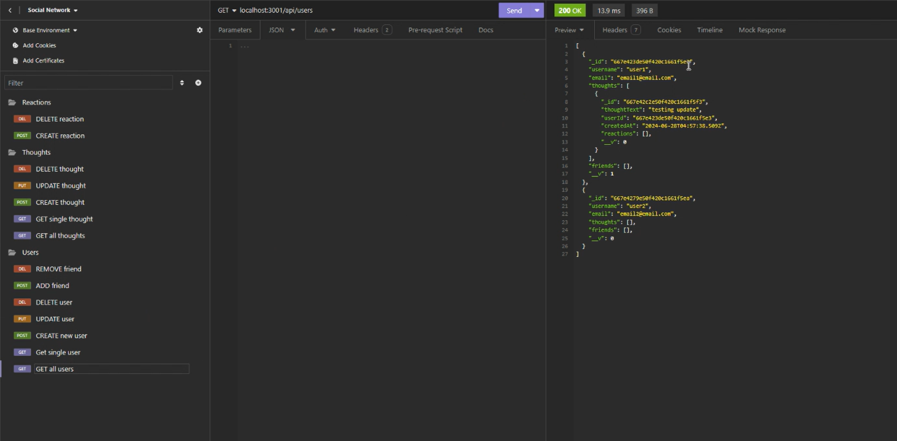
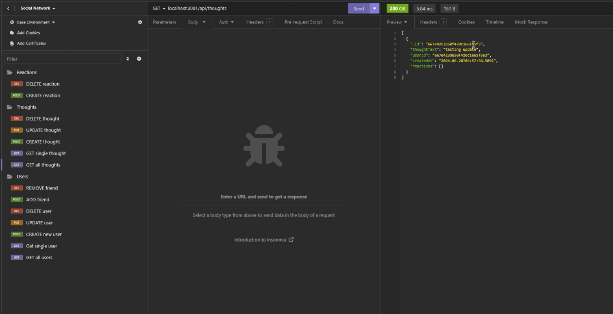

When you test 'GET single user' or 'GET singlethought', you will then see just one of either the usera or thoughts in the database. You can try this for any user or thought,by entering their specific ID in place of the number in the URL.

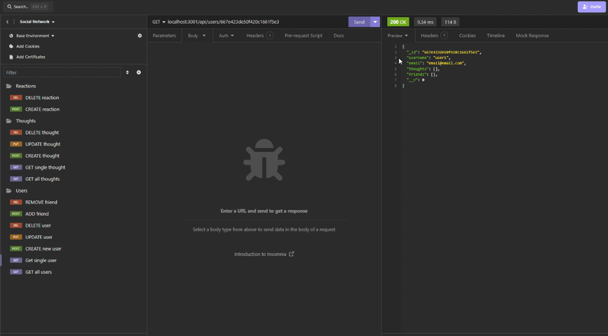
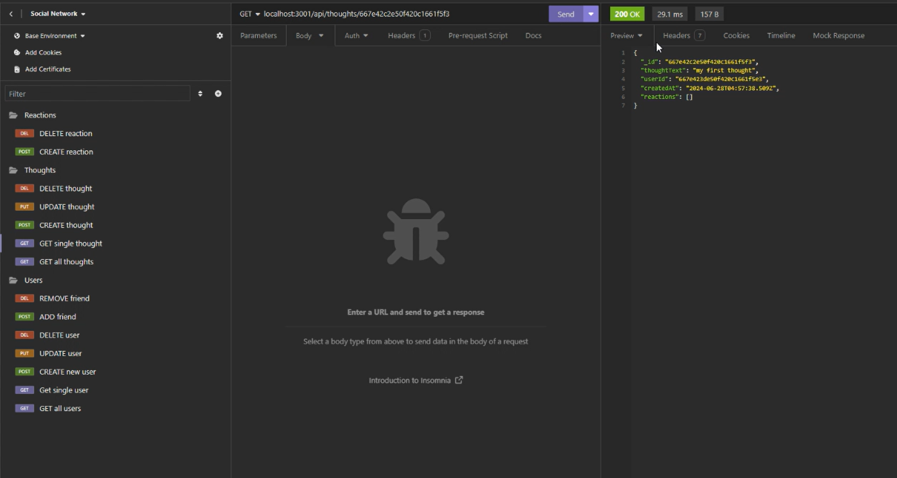

When you test 'CREATE user' or 'CREATE thought', you will see a body that will be added to the database. To view this, run one of the 'GET' requests. To test 'CREATE reaction', enter the ID of the thought you want to react to in the URL and create a body and it will be added as a reaction to the thought you specified. To test 'ADD friend', enter the ID of a user and then enter the ID of the friend you want to add to that user in the URL and that user will be added as a friend. Run one of the 'GET' requests to check.

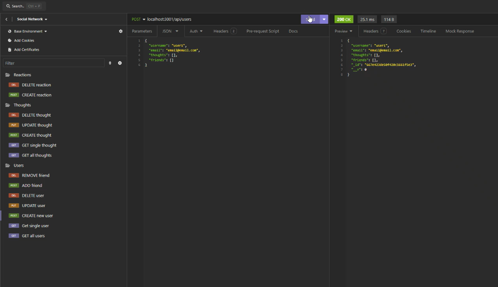
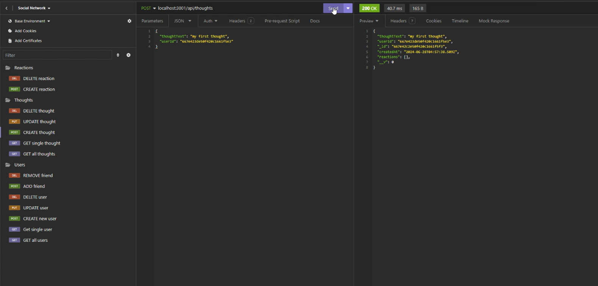
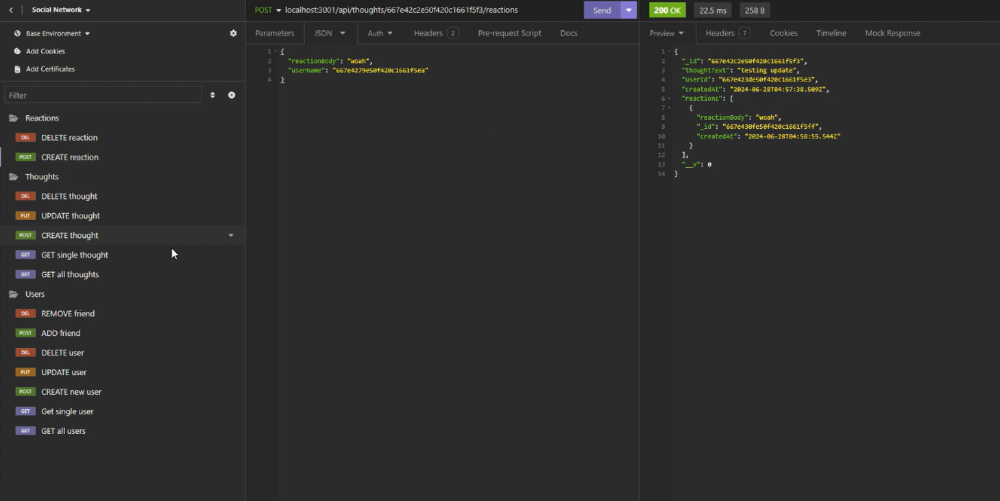
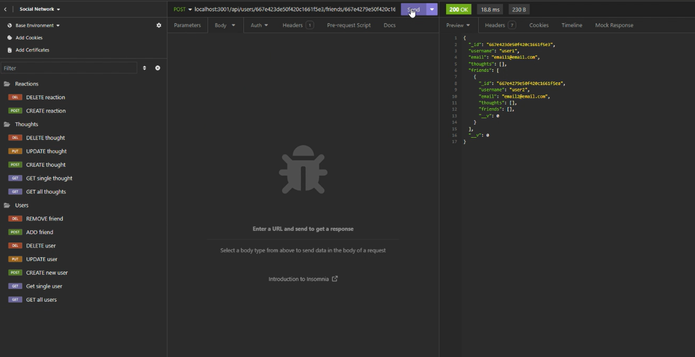

When you test 'UPDATE user' or 'UPDATE thought', you will see a body that will be replace a piece of data in the database based on the ID in the URL. To view this, run one of the 'GET' requests.

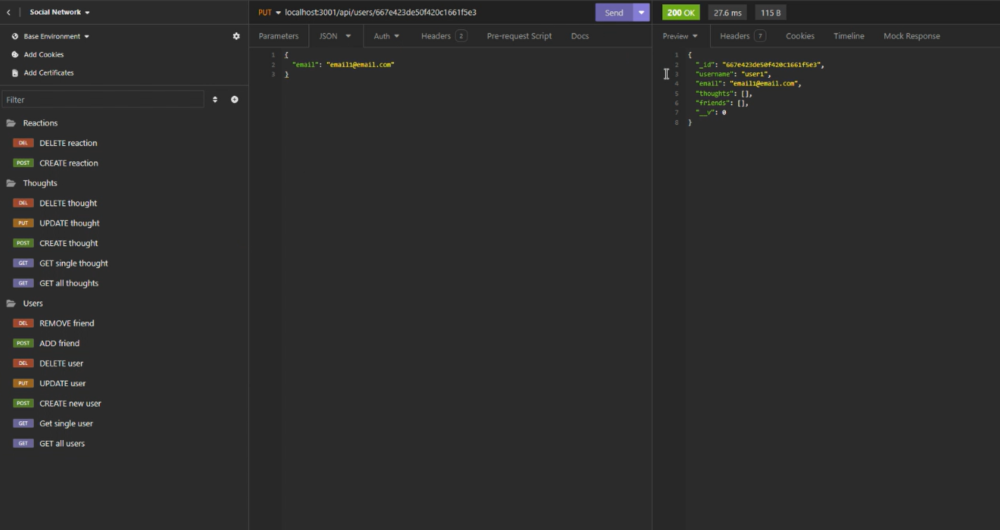
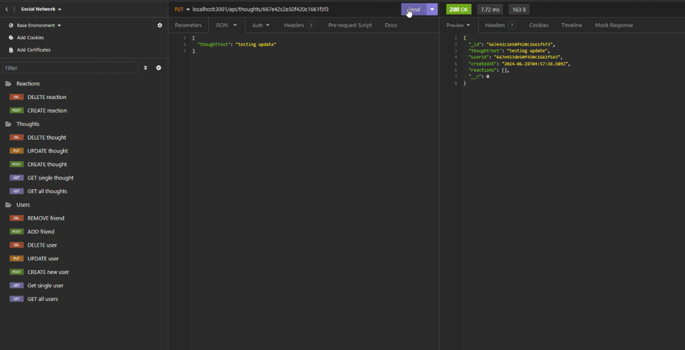

When you test 'DELETE user', 'DELETE thought', 'DELETE reaction', REMOVE friend, you will delete (or remove) a piece of data in the database based on the ID(s) in the URL. To view this, run one of the 'GET' requests to check if it is still there.

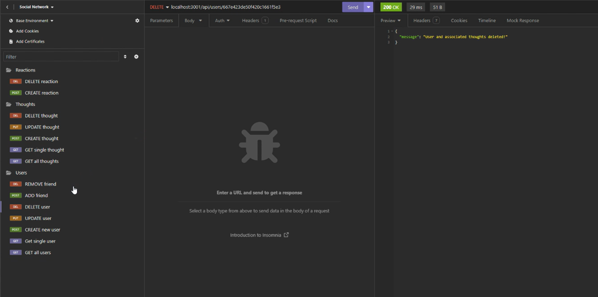
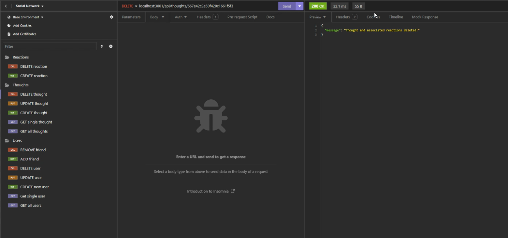
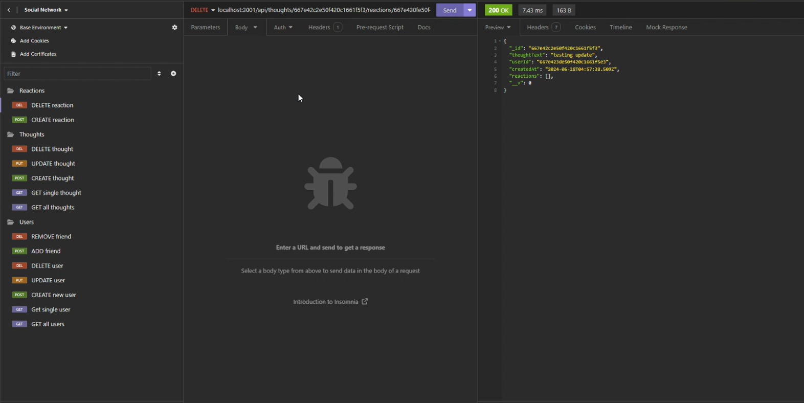
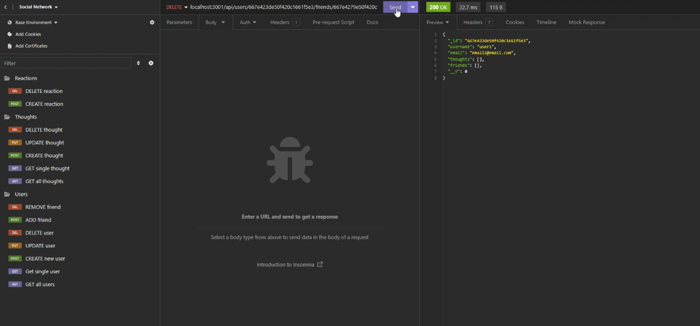
